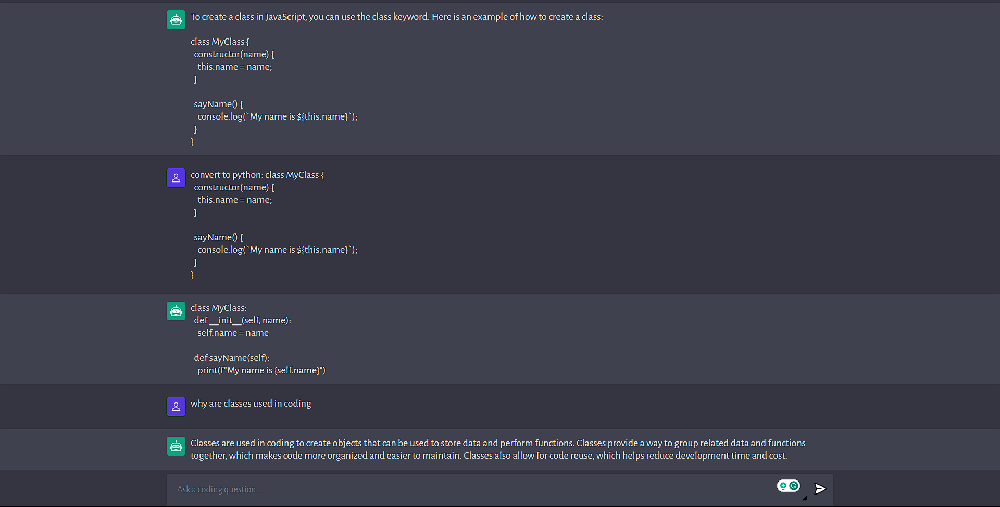

# Code Wizard AI

Code Wizard is an AI-powered JavaScript app that provides coding assistance. It is accessible through a user-friendly interface, and by simply typing a question, the AI will provide a relevant response.

## Table of contents

- [Overview](#overview)
  - [Objective](#Objective)
  - [Screenshot](#screenshot)
  - [Links](#links)
- [My process](#my-process)
  - [Built with](#built-with)
  - [What I learned](#what-i-learned)
  - [Continued development](#continued-development)
- [Author](#author)
- [Acknowledgments](#acknowledgments)

## Overview

### Objective

- To create a project simialar to ChatGPT 

### Screenshot



### Links

- Live Site URL: [https://coding-ai-eta.vercel.app/](https://coding-ai-eta.vercel.app/)

## My process

### Built with

- Semantic HTML5 markup
- CSS
- Flexbox
- Vanilla Javascript
- Vite
- Node JS
- Express JS
- OpenAI API

### What I learned

Through this project, I enhanced my knowledge of APIs by integrating and utilizing OpenAI's machine learning model.

```js
 const response = await fetch('https://coding-ai-bb71.onrender.com', {
    method: 'POST',
    headers: {
      'Content-Type': 'application/json'
    },
    body: JSON.stringify({
      prompt: data.get('prompt')
    })
  })
```

### Continued development

- Create a landing page
- Implement sign-in functionality
- Introduce code collaboration features

## Author

- Website - [Terrell Jackson](https://terrelljackson.vercel.app/)

### Acknowlegements

- Website - [JS Mastery Pro](https://www.jsmastery.pro/)
